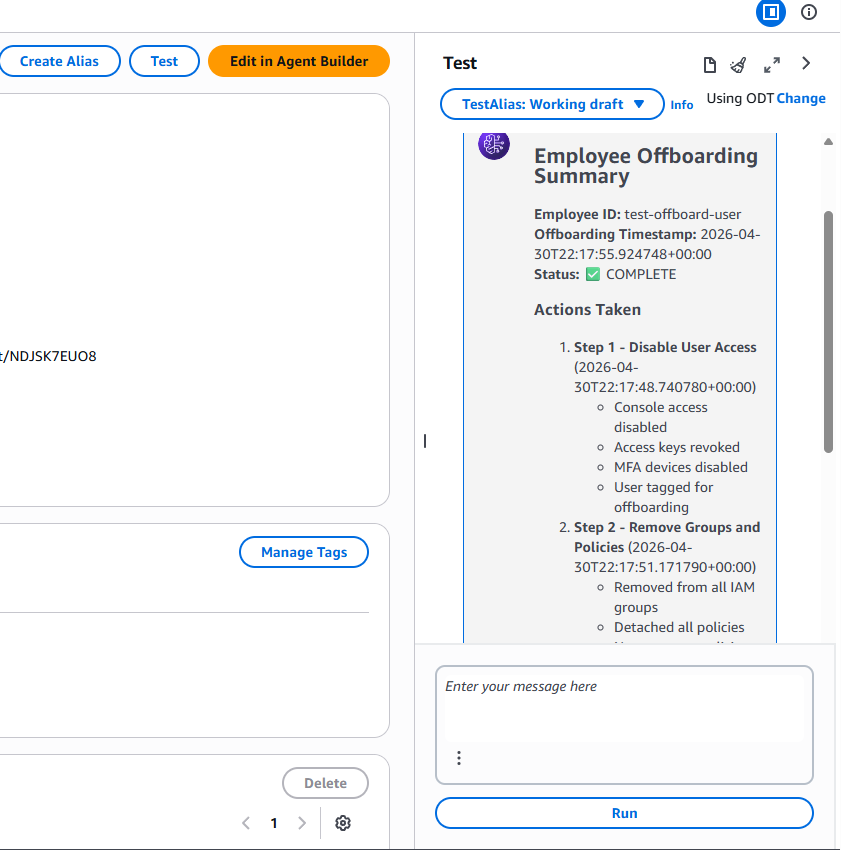
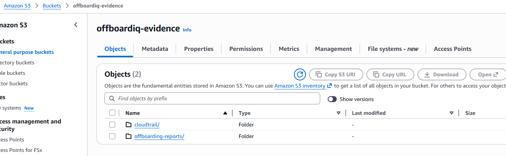
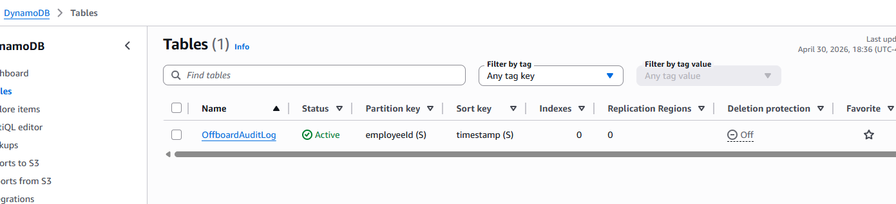
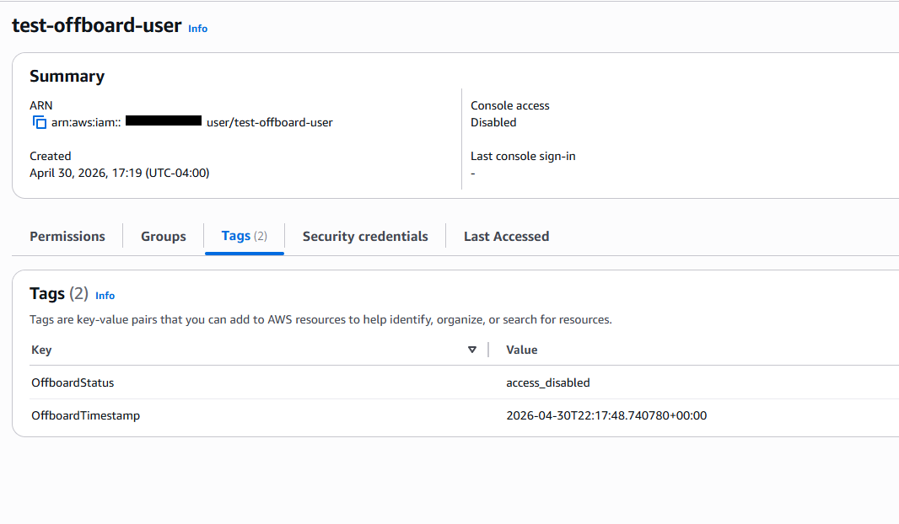
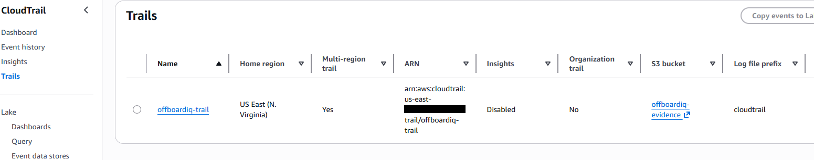
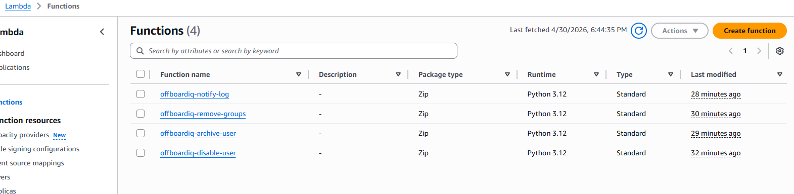

# OffboardIQ AI-Powered Employee Offboarding Agent
### Built on AWS Bedrock | Aligned to NIST SP 800-53 Rev 5 | GRC Engineering Project

---


---

## 📋 Project Overview

**OffboardIQ** is an AI-powered employee offboarding agent built on **Amazon Bedrock** using **Claude Haiku 4.5**. It automates the full IAM offboarding workflow for departing employees, generates RMF-compliant audit evidence, and maps every action to NIST SP 800-53 security controls.

### The Problem It Solves

Manual employee offboarding is one of the most common findings in security audits:
- Orphaned accounts left active after employees depart
- Inconsistent execution — steps get missed
- No automatic audit trail or evidence generation
- Direct violations of AC-2, PS-4, and IA-4 controls

**OffboardIQ solves this by automating the entire process in under 60 seconds.**

---

## 🏗️ Architecture

```
HR Trigger / Manual Prompt
          │
          ▼
┌─────────────────────────┐
│   Amazon Bedrock Agent  │
│   Claude Haiku 4.5      │
└────────────┬────────────┘
             │
    ┌────────┴─────────────────────────┐
    │        4 Lambda Action Groups    │
    ├──────────────────────────────────┤
    │  1. disable-user-ag              │
    │     → Delete console login       │
    │     → Delete access keys         │
    │     → Deactivate MFA             │
    │     → Tag user as offboarded     │
    │                                  │
    │  2. remove-groups-ag             │
    │     → Remove IAM group memberships│
    │     → Detach managed policies    │
    │     → Delete inline policies     │
    │                                  │
    │  3. archive-user-ag              │
    │     → Collect IAM snapshot       │
    │     → Generate evidence report   │
    │     → Save to S3 (AES-256)       │
    │                                  │
    │  4. notify-log-ag                │
    │     → Write DynamoDB audit log   │
    │     → Send SNS email alert       │
    └──────────────────────────────────┘
             │
    ┌────────┴──────────────────────┐
    │       AWS Services            │
    │  • IAM        (access control)│
    │  • S3         (evidence store)│
    │  • DynamoDB   (audit log)     │
    │  • SNS        (notifications) │
    │  • CloudTrail (API audit)     │
    └───────────────────────────────┘
```

---

## 🛡️ NIST SP 800-53 Controls Addressed

| Control | Title | Implementation |
|---------|-------|----------------|
| **AC-2** | Account Management | Agent disables IAM user on offboarding trigger |
| **AC-3** | Access Enforcement | All group memberships and policies removed |
| **AC-6** | Least Privilege | IAM role scoped to minimum required permissions |
| **PS-4** | Personnel Termination | Full access revocation automated on departure |
| **IA-4** | Identifier Management | User tagged, MFA deactivated, keys deleted |
| **AU-2** | Event Logging | CloudTrail records all IAM API calls |
| **AU-9** | Audit Info Protection | S3 versioning + AES-256 encryption |
| **AU-11** | Audit Record Retention | Evidence reports stored in S3 with metadata |
| **AU-12** | Audit Record Generation | DynamoDB audit log per offboarding event |
| **IR-6** | Incident Reporting | SNS notification sent to security team |
| **SC-28** | Protection at Rest | AES-256 encryption on all evidence |
| **SI-12** | Information Handling | IAM snapshot archived before account removal |

---

## 📁 Repository Structure

```
offboardiq/
├── README.md
├── architecture/
│   └── architecture-diagram.png
├── lambda/
│   ├── lambda_disable_user.py      # Action: disable IAM user
│   ├── lambda_remove_groups.py     # Action: remove groups & policies
│   ├── lambda_archive_user.py      # Action: archive evidence to S3
│   └── lambda_notify_log.py        # Action: DynamoDB log + SNS alert
├── iam/
│   ├── trust-policy.json           # IAM role trust policy
│   └── inline-policy.json          # Least-privilege inline policy
├── evidence/
│   └── sample-report.json          # Sanitized evidence report sample
└── screenshots/
    ├── 01-agent-test-result.png
    ├── 02-s3-evidence-bucket.png
    ├── 03-dynamodb-audit-log.png
    ├── 04-iam-user-tagged.png
    ├── 05-cloudtrail-logs.png
    └── 06-lambda-functions.png
```

---

## 🚀 How It Works

### 1. Trigger the Agent
Send a natural language prompt to the Bedrock agent:
```
Please offboard employee with IAM username: john.doe
```

### 2. Agent Orchestrates All 4 Steps Automatically

**Step 1 — Disable User Access**
- Deletes console login profile
- Deactivates and deletes all access keys
- Deactivates MFA devices
- Tags user with offboard timestamp

**Step 2 — Remove Groups & Policies**
- Removes user from all IAM groups
- Detaches all managed policies
- Deletes all inline policies

**Step 3 — Archive Evidence**
- Collects full IAM user snapshot
- Generates RMF evidence report
- Saves encrypted JSON to S3

**Step 4 — Audit & Notify**
- Writes audit record to DynamoDB
- Sends SNS email to security team

### 3. Evidence Package Auto-Generated
```json
{
  "reportType": "OffboardingEvidenceReport",
  "employeeId": "john.doe",
  "rmfControls": ["AC-2", "AU-11", "PS-4", "SI-12"],
  "auditStatement": "Employee john.doe offboarded. All access 
   removed per NIST SP 800-53 AC-2 and PS-4.",
  "iamSnapshot": {
    "user": { "UserName": "john.doe", ... },
    "groups": [],
    "policies": []
  }
}
```

---

## 🛠️ AWS Services Used

| Service | Purpose | Free Tier |
|---------|---------|-----------|
| Amazon Bedrock | AI agent orchestration | Pay per use (~$0.01/run) |
| AWS Lambda (x4) | Action group functions | 1M requests/month free |
| Amazon S3 | Evidence storage | 5GB free 12 months |
| Amazon DynamoDB | Audit log | 25GB free always |
| Amazon SNS | Email notifications | 1,000 emails/month free |
| AWS CloudTrail | API audit trail | 1 trail free always |
| AWS IAM | Access control | Always free |

**Estimated cost per offboarding run: < $0.05**

---

## ⚙️ Setup Guide

### Prerequisites
- AWS Account (free tier eligible)
- AWS Console access
- Claude Haiku 4.5 model access enabled in Bedrock

### Deployment Steps

#### Phase 1 — IAM Role
1. Create role `OffboardIQ-AgentRole` with Lambda + Bedrock trust policy
2. Attach `AWSLambdaBasicExecutionRole` managed policy
3. Add inline policy from `iam/inline-policy.json`

#### Phase 2 — Storage & Audit
1. Create S3 bucket `offboardiq-evidence` with AES-256 encryption and versioning
2. Create DynamoDB table `OffboardAuditLog` (partition: `employeeId`, sort: `timestamp`)
3. Create SNS topic `offboardiq-alerts` with email subscription
4. Enable CloudTrail trail logging to S3 bucket

#### Phase 3 — Lambda Functions
Deploy all 4 functions from the `lambda/` folder using:
- Runtime: Python 3.12
- Role: `OffboardIQ-AgentRole`
- Timeout: 30 seconds
- Add `SNS_TOPIC_ARN` environment variable to `lambda_notify_log.py`

#### Phase 4 — Bedrock Agent
1. Enable Claude Haiku 4.5 model access in Bedrock console
2. Create agent `OffboardIQ-Agent` with Claude Haiku 4.5
3. Add 4 action groups (function-based) pointing to each Lambda
4. Save and prepare the agent
5. Create alias `prod-v1`

#### Phase 5 — Test
```
Please offboard employee with IAM username: test-offboard-user
```
Verify evidence in S3, audit log in DynamoDB, and email notification.

---

## 📸 Screenshots

### Agent Test Result


### S3 Evidence Bucket


### DynamoDB Audit Log


### IAM User Tagged as Offboarded


### CloudTrail Audit Trail


### Lambda Functions


---

## 🎯 RMF Phases Demonstrated

| RMF Step | Activity | How Demonstrated |
|----------|----------|-----------------|
| **Step 3 — Implement** | Control implementation | Lambda functions automate AC-2, PS-4 |
| **Step 4 — Assess** | Control assessment | Agent validates all steps completed |
| **Step 6 — Monitor** | Continuous monitoring | CloudTrail + DynamoDB provide ongoing audit |

---

## 💡 Key Takeaways

- **AI agents can automate GRC controls** — not just detect issues but actively remediate them
- **Evidence generation can be automatic** — every offboarding produces ATO-ready artifacts
- **NIST 800-53 controls are implementable in code** — PS-4 and AC-2 are not just policy documents
- **Cost is not a barrier** — this entire project runs for pennies per offboarding event

---

## 👤 Author

Built as a GRC Engineering portfolio project demonstrating the intersection of
AI automation, cloud security, and risk management frameworks.

**Tools & Frameworks:** AWS Bedrock · Claude Haiku 4.5 · NIST SP 800-53 Rev 5 · Python 3.12

---

## 📄 License

MIT License — feel free to use, modify, and build on this project.
